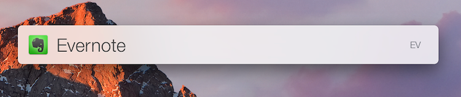
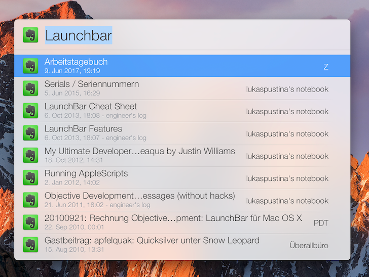
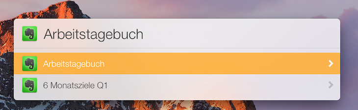

# "Better" Evernote Integration for Launchbar

The current Evernote integration in Launchbar version 6.8 (6140) has a few short comings that make it difficult to interact with Evernote through Launchbar. For example, search terms are concatenated with `%20` as in URL encoded space, there is no preview of found notes you could select from, and creating new notes does not work with Evernote more recent than version 5.

This Launchbar Action mitigates these short comings.

<p align="center"></p>

<!-- START doctoc generated TOC please keep comment here to allow auto update -->
<!-- DON'T EDIT THIS SECTION, INSTEAD RE-RUN doctoc TO UPDATE -->
**Table of Contents**

- [Features](#features)
  - [Open Evernote](#open-evernote)
  - [Search for Notes](#search-for-notes)
  - [Favorite Notes](#favorite-notes)
  - [Saved Searches](#saved-searches)
  - [Create new Note](#create-new-note)
  - [Synchronize Now](#synchronize-now)
  - [Action Settings](#action-settings)
- [Installation](#installation)
- [Configuration](#configuration)
  - [Configuration Settings](#configuration-settings)
- [Known Limitations](#known-limitations)
- [Credits](#credits)

<!-- END doctoc generated TOC please keep comment here to allow auto update -->

## Features

### Open Evernote

<p align="center"></p>

In case you just want to open Evernote's main window, just press `<Return>` before entering a search query.

### Search for Notes

<p align="center"></p>

Search queries may make use of the full [Evernote Search Grammar](https://dev.evernote.com/doc/articles/search_grammar.php). For example:

* `search terms` -- matches notes that contain these terms in its full text

* `intitle:"Words in title"` -- maches notes with these words in the title

* `created:day-1` -- matches notes created yesterday or today

* `todo:*` -- matches notes that contain todos

See the link above for more details of Evernote's search grammer.

You can open any matching note by navigating to the search result and pressing `<Return>`. The search results show the title, the date of the last modification, the tags -- if any --, and the notebook of each matching note.

You can copy an Evernote link of a note to the clipboard by navigating to the search result and pressing `<CMD>+<Return>`. This allows you to create references to your notes in other applications as well as in other notes. These references will be opened by Evernote on your desktop; not the browser.

### Favorite Notes

<p align="center"></p>

If you want a shortcut to notes you use frequently, add them as favorites notes in the settings file and open them quickly in the *Favorites* sub menu.

### Saved Searches

<p align="center"></p>

If you happen to search for specific queries regularly, you can save these queries as "saved searches" in the settings file and easily activate them in the *Saved Searches* sub menu.

### Create new Note

You can easily create a new note in the default notebook with the *Create new Note* menu item.

### Synchronize Now

You can trigger note synchronization the *Synchronize Now* menu item.

### Action Settings

In order to change the default settings, add favorite notes, or saved searches, use the *Edit Settings* menu item. It will open the settings configuration file in your default editor application.


## Installation

1. Clone this repository

1. Deactivate the build-in Evernote integration in Launchbar's _Settings -> Index -> Show Indesx ->  Applications -> Evernote_.

1. Double click the cloned repository directory in Finder.


## Configuration

Since Launchbar does offer a built in mechanism for Action settings, this Action uses a JSON file called `settings.js` to configure its settings. The format is shown below and easy to use. Here is an example:

```
{
  "debug": true,
  "max_results": 20,
  "favorites": [
    { "name": "A frequently used note", "note_link": "evernote:///view/722304695/s5/1207980e-41aa-8c3a-db9c15c1fef1/120798e0-80e9-41aa-8c3a-db9c15c1fef1/" },
    { "name": "Another regularly used note", "note_link": "evernote:///view/73204695/s5/928ee3f8-40c7-a3d0-7ab971452551/928eef38-9121-40c7-a3d0-7ab971452551/" }
  ],
  "saved_searches": [
    { "name": "Launchbar Actions", "search": "\"Launchbar Actions\"" }
    { "name": "Notes with 'Launchbar' in title", "search": "intitle:\"Launchbar\"" },
    { "name": "Created yesterday or ealier", "search": "created:day-1" },
    { "name": "Note with todos", "search": "todo:*" },
  ]
}
```

### Configuration Settings

* `debug`: If `true` debug messages are logged to the Console `[default = false]`.

* `max_results: The maximum number of results a search should return.  Increasing this setting may have performance impacts `[default = 20]`.

* `favorite`: A list of favorite note `[default = []]`.

    The list elements consist of a name and the Evernote internal note link; cf. [Saved Searches](#saved-searches) on how to obtain a note link. See above for examples.

* `saved_searches`: A list of saved searches `[default = []]`.

    The list elements consist of a name and search query in Evernote's search grammer; cf. [Saved Searches](#saved-searches) for how to use the search grammer. It is important to note that every `"` as part of the search query has be escaped using `\`, i.e., `\"`. See above for examples.


## Known Limitations

1. This Action requires Evernote to run. If it is not running, any action will start it automatically, grabbing the focus. Thus, Lauchbar loses the focus and needs to be re-invoked.


## Credits

Icons are (C) by [Designerz Base](https://www.iconfinder.com/iconsets/faticons) licensed free for commercial use.

